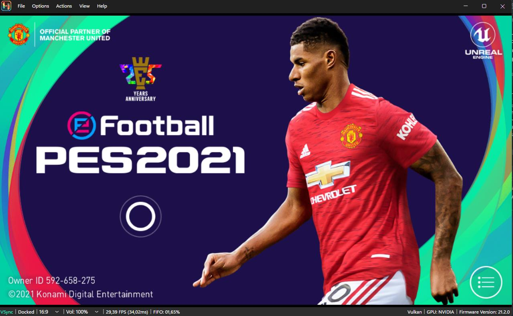
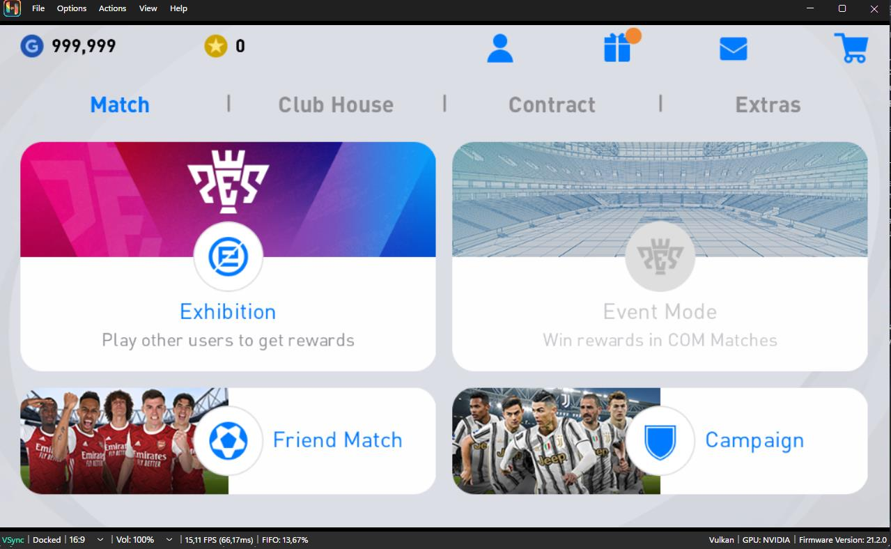
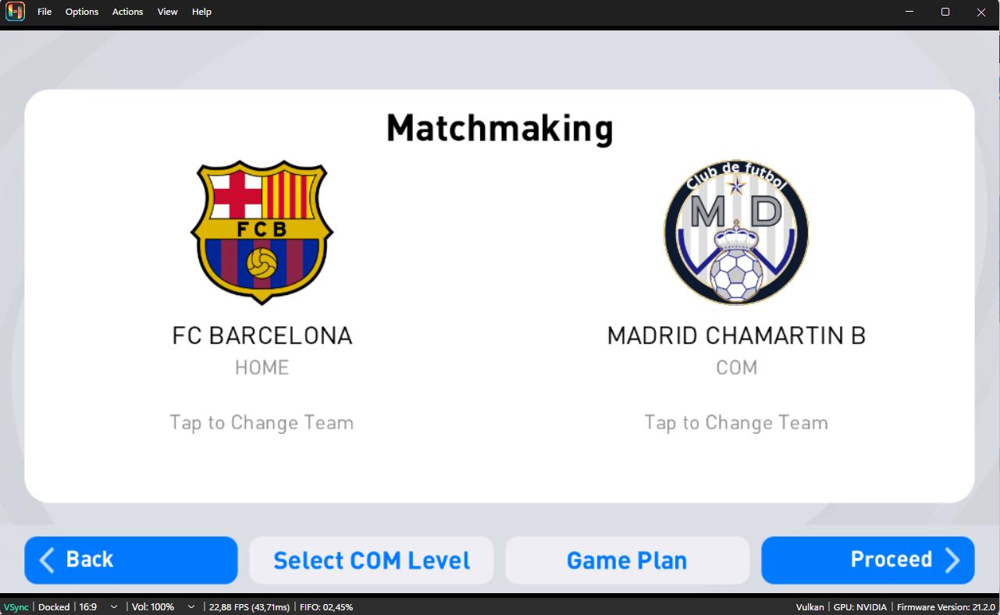
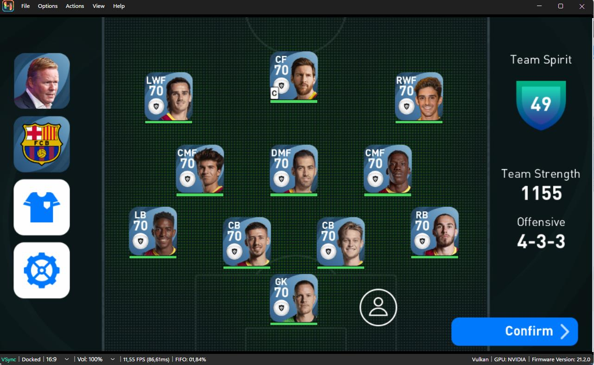
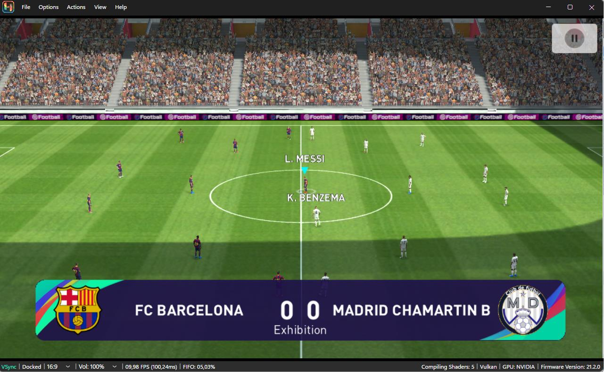

# PES 2021 NX

PES 2021 NX is an experimental Android arm64 compatibility wrapper for
Nintendo Switch homebrew. It runs the original game libraries through native
libnx-backed Android, Bionic, JNI, audio, input, filesystem, and graphics
compatibility shims; it is not an Android emulator.

This repository contains wrapper source code, project-authored preparation
tools, and compatibility screenshots only. It does **not** contain an APK,
OBB, native game libraries, extracted runtime assets, saved data, or private
keys. Supply a legally obtained compatible copy of the game. Do not request
copyrighted files, download links, private keys, or piracy support.

This independent project is not affiliated with, authorized, sponsored, or
endorsed by Konami. All product names, trademarks, and copyrighted game
content belong to their respective owners.

## Compatibility target

The supported target is **PES 2021 Mobile v5.3.0**
(`versionCode 305030001`, package `jp.nyan2021.pesam`), specifically the
**Nyan Mod Offline** edition. Other revisions and packages are not expected to
work without source changes.

The Nyan Mod files are not included, maintained, or distributed here. Credit
goes to **Nyan Mod** for the offline modification used during development.

## Screenshots

  
  
  
  
  

## How to install

1. Download and extract the latest `PES21NX-Prepare-v*.zip` release into an
   empty folder.
2. Put these three legally obtained files in that same folder:
   - the compatible PES 2021 Mobile APK;
   - `main.305030001.jp.nyan2021.pesam.obb`;
   - `patch.305030001.jp.nyan2021.pesam.obb`.
3. Run `PES21NX-Prepare.exe` and select that folder. The release NRO is already
   included in the preparation bundle. The preparer also embeds the PES
   application icon extracted from your APK into the installed NRO.
4. Wait for the tool to create `switch/pes21_nx/`, then copy the generated
   `switch` folder to the root of the Nintendo Switch SD card and merge it with
   the existing folder.
5. Launch `pes21_nx.nro` through a full-memory title override. Do not launch it
   in Album applet mode.

The preparer validates all inputs and will not overwrite an existing generated
runtime or its `SaveData`. Back up or move an earlier `switch/pes21_nx/` output
before preparing a clean installation.

For release history and known limitations, see [CHANGELOG.md](CHANGELOG.md).
For source builds and porting details, see
[DEVELOPMENT.md](DEVELOPMENT.md) and [CONTRIBUTING.md](CONTRIBUTING.md).

## License

Wrapper code is distributed under the MIT license; see [LICENSE](LICENSE) and
[NOTICE.md](NOTICE.md). No license is granted for separately obtained game
content.

## Credits

Porting concepts and ideas that helped shape this project were inspired by
work shared by [NaGaa95](https://github.com/NaGaa95).

Credit also goes to **Nyan Mod** for the PES 2021 Mobile v5.3.0 offline
modification used as this project's compatibility target.
